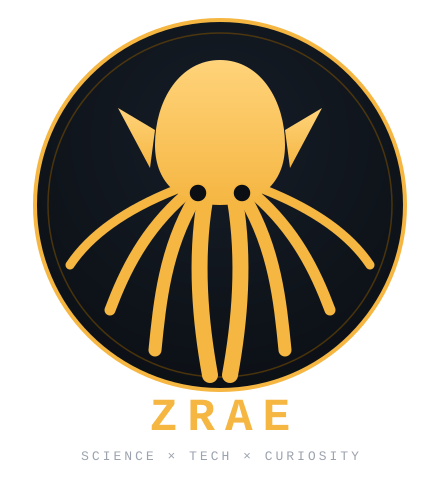

   

 🔬 We study what the naked eye cannot see, because the invisible often controls the visible.

 

  

 
🩷 Live profile visitors  

---

🧫 ABOUT

«Microbiology & Quality Control Professional · Scientific Researcher · Digital Builder»

I work at the intersection of microbiology, quality control, scientific research, forensic science and technology — bacteriology, virology, biofilms, contamination control, ISO/Codex standards and more.

Outside the lab, I turn scientific and educational problems into structured, accessible digital tools — see them in "Featured Projects" (#projects).

🧬 The Workflow

OBSERVE → QUESTION → RESEARCH → DESIGN → BUILD → VALIDATE → IMPROVE

(then loop back to OBSERVE — and repeat)

---

🎓 ACADEMIC PROFILE

🎓| Academic path
🏛️ Institution| Université des Sciences et de la Technologie Houari Boumediene — USTHB
🧬 Program| Postgraduate — Master, Microbiology & Quality Control
📅 Stage| Final Master year
🗓️ Expected completion| 06 / 2027

---

🔬 SCIENTIFIC UNIVERSE

 

 

---

🧪 LABORATORY & SCIENTIFIC TOOLBOX

 

 

---

💻 TECH STACK

🌐 Web & Application Development

  

"HTML5" · "CSS3" · "JavaScript" · "Node.js" · "React.js"

🐍 Programming, Data & Databases

  

"Python" · "Ruby" · "R" · "SQL" · "PostgreSQL" · "MySQL" · "SQLite"

🐧 Systems & Development

  

🎨 Design, UI/UX & Productivity

  

---

🚀 FEATURED PROJECTS

🧪 MicroLab Pro

 
A microbiology and quality-control toolbox designed around practical scientific workflows.

Tool| Purpose
🧫 MicroID| Bacterial identification
🔬 MicroPath| Diagnostic / antibiogram assistance
📊 MicroCalc| Laboratory calculations
📚 MicroPedia| Microbiology reference
🧴 MicroSteril| Sterilization & disinfection reference

Highlights: "200+ bacterial species" · "5 integrated tools" · "ISO" · "Codex" · "CASFM" · "JORA"

Interface: 🇩🇿 Arabic · 🇫🇷 French · 🇬🇧 English

---

🧭 Microbial Odyssey

 
A historical and scientific microbiology archive connecting microorganisms, scientists, discoveries, experiments and locations.

🦠| Species| 👨‍🔬| Scientists| 🔬| Discoveries
🧫| 95| 🧑‍🔬| 55| 💡| 31

📍| Locations| 🧪| Experiments| 📖| Glossary
🗺️| 40| 🧬| 12| 📚| 77

Highlights: "🗺️ Interactive map" · "⏳ Timeline" · "🧪 Experiments" · "❓ Quiz" · "📚 Glossary" · "🌍 Multilingual"

---

🌌 MicroVerse

 
A microbiology-focused digital environment built for exploration, learning and scientific discovery.

Highlights: "🦠 Microbiology" · "🔬 Exploration" · "💻 Digital Science" · "🌌 Discovery"

---

🧪 LabPrep DZ

 
A multilingual medical-analysis preparation guide focused on laboratory test preparation.

Domains: "🧪 Biochimie" · "🩸 Hématologie" · "🦠 Bactériologie" · "🧬 Hormonologie" · "🛡️ Immunologie" · "🪱 Parasitologie" · "🚽 Urologie" · "🧬 Sérologie" · "🩸 Coagulation"

Highlights: "📋 Preparation guidance" · "⏱️ Fasting timer" · "🇩🇿 Algerian context" · "🌍 Multilingual"

---

«The objective is not simply to know something.
The objective is to make knowledge useful.»

---

🌍 LANGUAGES

---

📊 GITHUB COMMAND CENTER

📈 GitHub Statistics

  

🔥 Contribution Streak

  

📊 Contribution Activity

  

🏆 GitHub Trophies

⚡ Recent Activity

<!--START_SECTION:activity--><!--END_SECTION:activity--><em>Automatically updated every few hours by GitHub Actions.</em>

---

🗂️ PROJECT REPOSITORIES

 
---

🤝 COLLABORATION

🧫 Microbiology  • 
🧪 Quality Control  • 
⚖️ Forensics  • 
🧬 Molecular Biology

🏥 Medical Analysis  • 
🧠 Neuroscience  • 
💻 Scientific Technology  • 
🚀 Innovation

---

📫 CONNECT

---

🦑 ZRAE SIGNATURE

---

  

☀️ BUILD · RESEARCH · QUESTION · DISCOVER ☀️

 Crafted with 🦑 & JetBrains Mono

  

